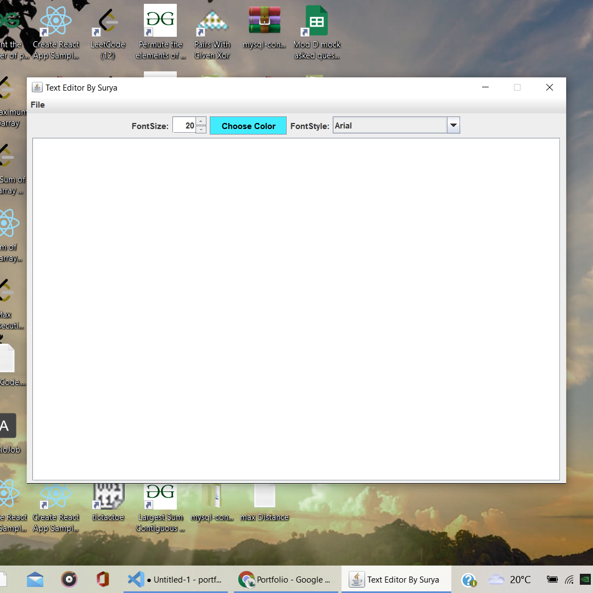

# Basic-TextEditor-with-java

To develop an application similar to notepad, which has similar functionalities.

At first, I have created GUI and then added functionalities to GUI using Action Listeners.

We can create new files, edit existing files, change font sizes, colors of text, font-wrap etc.

## Skills used:
Java,OOPs,Swing (Java).

 

